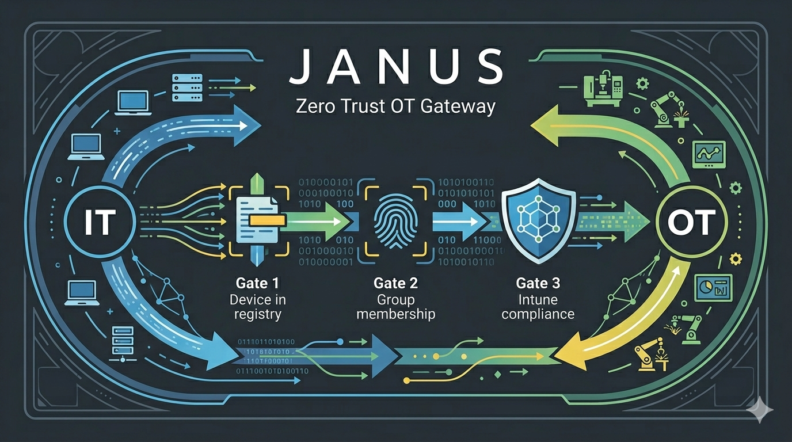
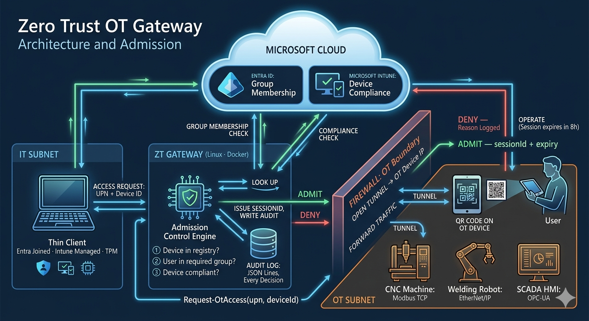

# Janus — Zero Trust OT Gateway

A stateless admission control service for accessing Operational Technology (OT) devices —
CNC machines, welding robots, SCADA HMIs — from the IT side of a manufacturing network.

## Core Question

> *Is this user, on this device, allowed to reach that machine right now?*

A request is admitted only if **all three** gates pass:

1. The OT device is in the registry the gateway knows about.
2. The requesting user is a member of the Entra ID group required for that specific device.
3. The user has at least one Intune-managed device that is currently reporting `compliant`.

If all three pass, the gateway issues an 8-hour session ID and (in production) opens a
tunnel to the OT device's IP. If any gate fails, access is denied. **Every decision —
admit or deny — is written to an append-only audit log.**

---

## What Janus is — and what it isn't

**Janus is a stateless admission decision service.** Given a request of the form
`(upn, deviceId)`, it consumes live identity, group, and compliance signals from
Microsoft Graph, runs them through a fixed sequence of gates, and emits a single
decision: ADMIT (with a session ID and expiry) or DENY (with a reason). Every
decision lands in an append-only audit log.

In practice: a client asks Janus "can this user access this device?", Janus returns
a decision, and a transport layer enforces it.

**Janus is not:**

- **A network tunnel.** The decision engine emits a session ID; the actual
  transport (TCP proxy, WireGuard, SSH forward, YARP-fronted reverse proxy) is
  a separate concern that consumes Janus's decisions.
- **An identity provider, MDM, or compliance platform.** Janus consumes Entra
  ID and Intune. It does not replace them.
- **A SIEM.** Janus produces the audit records that a SIEM ingests.
- **A general-purpose ZTNA product.** Use Cloudflare Access or Entra Private
  Access for SaaS and web app access. Use Janus where the protected resource
  speaks Modbus, EtherNet/IP, or OPC-UA.
- **A firewall replacement.** Janus sits behind your existing network
  segmentation as an identity-aware admission layer, not in place of it.

---

## Why this doesn't exist yet

Enterprise ZTNA products (Zscaler, Cloudflare Access, Entra Private Access,
Tailscale Enterprise) are priced and architected for organizations that have
already converged on web and SaaS protocols. They assume the protected
resources speak HTTP, RDP, or SSH. OT gear does not — it speaks Modbus TCP,
EtherNet/IP, OPC-UA, and a long tail of vendor-specific protocols designed
twenty years before Zero Trust was a phrase.

The gap Janus fills:

- **Small enough to deploy at a 30-person machine shop**, both in dollars and
  in operational complexity. No mesh overlay, no per-seat enterprise contract,
  no agent on every OT device.
- **Identity-grounded, not network-grounded.** Most existing OT-side controls
  are still ACLs, VLAN tags, and jump hosts. Janus puts a UPN and a compliance
  state in the decision path of every session.
- **Built around CMMC 2.0 evidence requirements.** The audit log is the output,
  not an afterthought. Every gate, including denials, produces a structured
  record an assessor can read.
- **Protocol-agnostic at the transport layer.** The decision engine doesn't
  care whether the tunnel is TCP, IP, or application-layer; it emits a session
  ID that a transport plug-in keys off.

**This is not a missing feature — it is a missing architecture.**

---

## Who this is for

Janus has two audiences:

- **Operationally**, it is aimed at **smaller machine shops** that need to bring
  legacy OT infrastructure into a Zero Trust posture to meet **CMMC 2.0**
  requirements without ripping out the OT equipment they already own.
- **Technically**, it is aimed at **backend, platform, and security engineers**
  who can take the PowerShell PoC's behavior contract and build the production
  service in a language that fits long-running infrastructure. The PoC is a
  reference specification, not a finished product. See
  [`CONTRIBUTING.md`](CONTRIBUTING.md) for where to plug in.

The compliance story this design supports:

- **MFA without retrofitting OT.** Authentication happens at the gateway against the
  user's Entra-joined thin client. With **TPM-backed Windows Hello for Business**, the
  thin client itself satisfies the multi-factor requirement (something-you-have: the TPM;
  something-you-are: the biometric or PIN tied to it). The CNC, welding robot, or HMI
  never has to know what MFA is.
- **Continuous device-health enforcement.** Intune compliance state is checked on every
  admission decision, not at enrollment time. A machine that falls out of compliance
  loses access on its next session.
- **Identity-bound, time-bound sessions.** Every session has a UPN, a session ID, and an
  8-hour expiry. There is no shared service account into the OT subnet.
- **Audit-friendly by construction.** Every admit and every deny appends one JSON Lines
  entry to an immutable log: timestamp, decision, UPN, device, reason. That log is the
  evidence artifact assessors are looking for.

The point is not to replace the existing network segmentation; it is to put a Zero Trust
identity boundary in front of it so that the legacy gear behind the firewall can stay
exactly where it is.

---

## Architecture



Architecturally, Janus is a **stateless decision service**: every request is evaluated
independently against the live state of the device registry, Entra ID, and Intune,
and nothing about a previous decision shapes the next one. State that must live
somewhere — the device registry, the audit log, an active session table for tunnel
correlation — sits *outside* the decision engine, so the engine itself can scale
horizontally and fail without losing context.

### How a request flows

1. **The user scans a QR code** on the OT device with their thin client. The QR encodes
   the device ID; the client already knows the user's UPN.
2. **The thin client calls the gateway** with `(upn, deviceId)`.
3. **Gate 1 — device lookup.** The gateway looks `deviceId` up in its local registry.
   If the device is not in the registry, the gateway denies with `Device not in registry`,
   writes an audit entry, and returns. *No Graph calls are made for unknown devices.*
4. **Gate 2 — group membership.** The gateway calls `Get-MgUserMemberOf` against Entra
   ID and checks whether the user is a member of the `requiredGroup` for that specific
   device (e.g. `OT-CNC-Operators` for a CNC machine, `OT-SCADA-Admins` for a SCADA HMI).
   If not, deny with `Not a member of <group>`.
5. **Gate 3 — device compliance.** The gateway calls
   `Get-MgDeviceManagementManagedDevice` filtered by UPN and verifies that **at least
   one** of the user's managed devices is reporting `compliant`. If none are compliant,
   deny with `No compliant Intune-managed device found for user`.
6. **Admit.** The gateway mints a session ID (GUID), records an expiry 8 hours out, writes
   the audit entry, and (in production) opens a tunnel from the IT subnet to the OT
   device's IP through the firewall. The thin client gets back the session ID and expiry;
   the user operates the OT device until the session expires.

Every path through the function — including all three deny branches — writes exactly one
audit entry before returning. There is no way to reach the tunnel-open step without an
admit entry already on disk.

---

## Deployment patterns

Janus doesn't care what the requesting client physically is. It needs the
request to come from an **Entra-joined, Intune-managed Windows session** — that
session is what Gate 3 (Intune compliance) actually evaluates, not the user's
local hardware. The user's physical device can be a locked-down thin client, a
corporate laptop, or even a BYOD machine that does nothing but render a remote
session. The MFA story (TPM-backed Windows Hello for Business) applies at
whatever the user signs into first — thin-client OS, AVD client, or a local
workstation — and the Janus admission flow is identical in every case.

Pick the deployment pattern based on the shape of the shop:

**On-prem RDS / terminal server.** One Windows Server (or a clustered pair)
hosts the OT vendor software (Studio 5000, TIA Portal, FactoryTalk, vendor HMI
clients, CAM tools); technicians connect from cheap thin clients on the floor
via RemoteApp or full RDS sessions. Cheapest option for a small shop, works
during WAN outages, centralizes OT-software patching to one image. Trade: one
more on-prem box to own.

**Azure Virtual Desktop.** Same pattern, but the session hosts live in Azure.
Cleaner identity story (native Entra ID), no on-prem server to maintain, easier
multi-site rollout. Trades: a WAN outage stops the shop floor; back-haul to OT
devices needs a site-to-site VPN or ExpressRoute; and some OT vendors don't
certify their software on multi-session AVD, which can force you onto
single-session Windows 365 / dedicated AVD hosts and erode the cost advantage.

**Dedicated workstations.** A real Windows PC per technician, Entra-joined and
Intune-managed. Simplest model, no remoting layer to operate. Trades: no
centralized image (you patch every workstation), and per-seat OT-software
licensing tends to be expensive.

**AVD on Azure Stack HCI.** AVD's centralized image management on on-prem
hardware. Useful if you want the operational benefits of AVD without the WAN
dependency, but the infrastructure and licensing complexity is rarely worth it
below ~50 seats.

For a typical 10–30-person machine shop on a single site, **on-prem RDS** is
usually the right answer: cheap, offline-capable, and Gate 3 evaluates one
well-managed session host instead of a fleet of shop-floor laptops.

---

## Companion PowerShell module (planned)

Alongside the gateway, this project will ship a companion **PowerShell
management module** for deploying and operating Janus. The gateway itself has
no PowerShell dependency at runtime — the module is a separate artifact that
serves as the day-one operator surface for shops already living in PowerShell.

Planned capabilities:

- **Deployment** — pull and install the Janus container image, render
  configuration, lay down service definitions (systemd or Windows service),
  and verify the deployment is healthy.
- **State queries** — wrap the gateway's state endpoints in idiomatic cmdlets
  (`Get-JanusSession`, `Get-JanusDevice`, `Get-JanusDecision`,
  `Get-JanusHealth`).
- **Audit reporting** — filter the audit log by user, device, decision, or
  time window and render the assessor-ready compliance reports CMMC needs.
- **Device registry management** — add, remove, update, and bulk-import OT
  device entries with schema validation against `devices.json`.
- **Diagnostics** — health checks, Graph connectivity tests, per-UPN
  compliance-state spot checks.

**Looking further ahead**, the module is also intended to grow into a
multi-deployment management surface for **MSPs serving multiple machine shops**
— operating many on-prem Janus deployments from one operator console, with
audit-log aggregation, fleet-wide registry sync, and per-tenant scoping. This
direction is **post-MVP** and will be informed by what the first production
deployments need; the likely shape is Azure Arc + Lighthouse for
Microsoft-shop MSPs, or a custom RMM-style control plane for those who want to
keep customers off Azure.

The module is a planned deliverable, not yet implemented. When it ships, it
will live in a sibling repository and install from the PowerShell Gallery
(`Install-Module Janus`).

---

## What the PoC pins down

OT networks have historically been protected by air gaps and network segmentation alone.
That model is breaking down: vendors need remote support, technicians use mobile thin
clients, and IT/OT convergence means IT-side identity now matters on the plant floor —
and CMMC 2.0 expects controls that segmentation alone cannot demonstrate.

A Zero Trust gateway flips the question from *"is this packet on the right VLAN?"* to
*"who is this human, what device are they on, and is that device healthy?"* — and it
does that check on **every** session, against the live state in Entra ID and Intune,
not against a static ACL.

The PowerShell code in this repo is the **reference specification for Janus's
behavior**. It is not a demo to be discarded once a "real" version is written — it is
the canonical definition of what an admission decision looks like, what data flows
through the system, and what gets written to the audit log. A production port to
another language is a translation of this behavior, not a redesign of it.

The PoC pins down four things that production ports must preserve:

- **The decision contract.** Input: `(upn, deviceId)`. Output: an admit/deny result
  with reason, session ID, expiry, and resolved device metadata.
- **The data contracts.** OT device registry schema, admit/deny result shape, and
  audit entry shape are all defined here.
- **The gate sequence.** Three gates in a fixed order, with cheap fail-fast checks
  before expensive ones. Gate 1 is registry-only (no Graph call); Gates 2 and 3 are
  Graph-backed. New gates slot into this sequence — see "Extensibility" below.
- **The functional-core / imperative-shell split.** Pure decision logic that is
  trivially testable, surrounded by a thin shell that does the I/O. This is the
  property that makes the audit trail trivial to reason about during a CMMC
  assessment.

What the PoC is *not*: a production gateway. It does not actually open a network
tunnel — the admit path stops at issuing a session ID and writing the audit entry.
The transport layer (TCP proxy, WireGuard, SSH forward, etc.) is the obvious next
thing a software engineer extending this would wire up; the comment in
`Request-OtAccess.ps1` marks the exact spot.

---

## Repository contents

The codebase is deliberately split into two layers. The **functional core** is the
**portable decision engine** — a production port reproduces it function-for-function.
The **imperative shell** is **replaceable I/O** — a production port swaps it for
whatever the target language and runtime prefer.

### Functional core (portable decision engine)

Pure functions, no I/O, no Graph calls. These define the decision logic and are the
canonical specification a production port must reproduce:

- `Find-OtDevice` — registry lookup
- `Test-GroupMembership` — Entra group check against the device's required group
- `Test-IntuneCompliance` — at-least-one-compliant-managed-device check
- `New-AdmitResult`, `New-DenyResult` — decision constructors
- `New-AuditEntry` — audit record constructor

All live in `Request-OtAccess.ps1` and have full Pester coverage in
`Request-OtAccess.Tests.ps1`. Tests run offline with no Graph tenant required —
that is the property the production port must preserve.

### Imperative shell (replaceable I/O)

Functions that touch the world. A production port replaces each of these with
something appropriate for the target stack:

- `Get-DeviceRegistry` → registry-of-record (database, CMDB integration, etc.)
- `New-GraphClient` and Graph calls → `Microsoft.Graph` SDK in .NET, `msgraph-sdk-go` in Go, etc.
- `Write-AuditLog` → SIEM forwarder, signed append-only store, structured-log sink

### Reference data files

- `devices.json` — canonical OT device registry schema (deviceId, displayName,
  requiredGroup, location, protocol, ipAddress).
- `audit.log` *(generated)* — canonical admission decision output. The entry shape
  is part of the spec.

### Running the PoC

```powershell
.\Request-OtAccess.ps1 -DeviceId 'ot-cnc-01' -Upn 'jsmith@contoso.com'
```

This will prompt you to sign in to Microsoft Graph (scopes: `User.Read.All`,
`GroupMember.Read.All`, `DeviceManagementManagedDevices.Read.All`), run the three gates,
print the result, and append a line to `audit.log`.

### Running the tests

```powershell
Invoke-Pester .\Request-OtAccess.Tests.ps1
```

Tests are pure-function only — they run offline and require no Graph tenant.

---

## Building an MVP

The goal of the MVP is to reproduce the PoC's behavior as a network service.

A minimum viable Janus port is:

- [ ] **HTTP API.** `POST /admit` accepting `{ upn, deviceId }`, returning the
  admit/deny result schema. JSON in, JSON out.
- [ ] **Admission engine.** Port the functional core verbatim. Same function
  signatures, same return shapes, same audit-entry format. The Pester tests in
  `Request-OtAccess.Tests.ps1` are the conformance suite — pass an equivalent
  set in your target language.
- [ ] **Graph integration.** Production-grade auth: workload identity,
  certificate-based service principal, or managed identity — not interactive
  `Connect-MgGraph`. Token caching with expiry-aware refresh.
- [ ] **Device registry.** Persistent backing store. The PoC's flat JSON file is
  fine for v0; database or CMDB integration is v1.
- [ ] **Audit logging.** Append-only sink writing the canonical entry shape.
  **Implement as a swappable sink interface, not a hardcoded local-file write**
  — local file is fine for v0; SIEM forwarding is v1; remote push to an MSP
  control plane is post-MVP. All three should slot into the same interface
  without engine changes.
- [ ] **PowerShell-consumable state artifacts.** Beyond the append-only audit
  log, emit live system state in a form a PowerShell operator can query at any
  time with `Invoke-RestMethod` or `ConvertFrom-Json` — active sessions,
  registered devices, decision counts, configuration snapshot. The audit log
  answers "what happened"; these artifacts answer "what is true right now."
  **Make the endpoints suitable for remote consumption** (HTTPS, auth-aware,
  not localhost-only) so the same surface can serve the local PowerShell
  module today and a remote operator console later.
- [ ] **Session tracking.** Issue session IDs, store them with their expiry,
  expose `GET /session/{id}` for lookup and `DELETE /session/{id}` for early
  revocation.
- [ ] **Health and observability.** `/healthz`, structured logs, basic metrics
  (admit/deny rate, Graph latency, error rate).
- [ ] **Optional: transport plug-in.** When ready, wire up a tunnel substrate
  (YARP for HTTP-fronted access, WireGuard for L3, raw TCP proxy for everything
  else) keyed off the issued session ID. Out of scope for the decision-engine MVP.

Anything beyond this is post-MVP.

---

## Extensibility: adding a gate

Gates are composable by design. A new gate is three things:

1. **A pure function** that takes the request context and returns either
   `Allowed` or `Denied(reason)`. No I/O. Fully testable in isolation.
2. **A signal source** in the imperative shell that gathers whatever data the
   pure function needs — a Graph call, a database lookup, an external service
   hit, a clock read.
3. **A sequencing decision** in the engine. Cheap fail-fast checks run first
   (registry lookup is free; Graph calls are not). Place new gates accordingly.

Existing gates (`Find-OtDevice`, `Test-GroupMembership`, `Test-IntuneCompliance`)
all conform to this contract. A risk-score gate, a maintenance-window gate, a
per-device PIN-prompt gate, or a time-of-day gate would all slot in the same
way: pure decision function plus a shell-side data fetcher.

Two rules every gate must follow:

- **Deterministic.** Same inputs, same outputs, every time. A gate is *not* the
  place to add jitter, retries, or stochastic logic; those belong in the shell.
- **Auditable.** The deny reason must be a stable, human-readable string that
  can land verbatim in the audit log. An assessor reading the log should
  understand the deny without having to read code.

---

## Implementation direction

Janus is a **long-running service, not a script.** The runtime needs to handle
sustained admission load, maintain a Graph token cache, write to the audit sink
without blocking the decision path, and stay up for weeks. PowerShell is the
wrong shape for that — no first-class HTTP server, weak concurrency primitives,
and startup cost on every cold path. The recommendation below is **guidance for
whoever ports Janus**, not a neutral comparison of options.

### .NET languages (recommended)

#### C# — primary recommendation
- **Microsoft Graph SDK is first-class.** `Microsoft.Graph` and `Microsoft.Graph.Beta`
  are authored by the same team that owns the API; new endpoints land here first. Auth
  via `Azure.Identity` integrates cleanly with managed identity, workload identity, and
  certificate-based service principals — the auth modes a real deployment will need.
- **ASP.NET Core / Kestrel / YARP** give us a credible HTTP front end and a battle-tested
  reverse-proxy substrate for the actual tunnel-opening step the PoC stubs out. YARP in
  particular was built for exactly this shape of problem.
- **Mature observability story.** OpenTelemetry, structured logging via `ILogger`, and
  health-check middleware are baseline; the audit log can become a structured sink
  without extra ceremony — and structured logs are exactly what a CMMC assessor will ask
  to see.
- **Runs natively on Linux containers**, AOT-compiles for faster startup, and has the
  largest pool of engineers inside most Microsoft-shop organizations who can maintain it.
- **Trade-off:** the functional-core split we have in the PoC has to be enforced by
  discipline; C# does not push you toward immutability the way F# does.

#### F# — recommended for the admission core if a maintainer can own it
- **The functional-core / imperative-shell architecture is F#'s native idiom.** The pure
  decision functions (`Find-OtDevice`, `Test-GroupMembership`, `Test-IntuneCompliance`,
  result/audit constructors) translate almost line-for-line into F# with discriminated
  unions for `Decision = Admit of Session | Deny of Reason` and records for the rest.
  That makes illegal states unrepresentable in a way C# cannot match without a lot of
  boilerplate.
- **Same SDK access as C#.** F# consumes `Microsoft.Graph` and `Azure.Identity` directly;
  no second ecosystem to maintain.
- **Pragmatic option:** F# core (decision logic + types) + C# shell (ASP.NET host,
  middleware, hosting) in a single solution. We get the type safety where it matters and
  the broader ecosystem where it doesn't.
- **Trade-off:** smaller hiring pool. If the team maintaining this won't have an F#
  speaker on it long-term, that is a real operational risk.

### Non-.NET candidates (not recommended for the primary path)

#### Go
- Static single binary, tiny container image, predictable runtime — attractive for a
  gateway. Strong concurrency primitives.
- The Microsoft Graph SDK for Go (`microsoftgraph/msgraph-sdk-go`) exists and is
  supported, but it lags the .NET SDK on new endpoints and the ergonomics are noticeably
  heavier (Kiota-generated builders, more ceremony per call).
- No discriminated unions, weaker type system for modeling the admit/deny decision
  cleanly.

#### Rust
- Best-in-class for a security-critical, long-running network service: memory safety,
  great async story, predictable performance.
- **Graph ecosystem is sparse.** No first-party SDK; community crates exist but are
  partial and not Microsoft-supported. We would be hand-rolling a non-trivial portion of
  the auth and Graph-call surface, which is exactly the part of the system we want to be
  boring.
- Reasonable choice if Graph access is wrapped in a thin C# sidecar and Rust handles only
  the tunnel transport, but that is two services to operate instead of one.

### Recommendation

Port the PoC to **C# on ASP.NET Core**, with the admission core in **F#** if we have at
least one engineer who will own that code path long-term. Keep the functional-core /
imperative-shell split that the PowerShell version already has — it is the single most
important piece of design to carry forward, because it is what makes the admission logic
testable without a Graph tenant and what makes the audit trail trivial to reason about
during an assessment.

---

## Where to start

A good first step is implementing the HTTP API and porting the functional core
into your target language. The Pester tests define the expected behavior and
serve as the conformance suite.

---

## Contributing

This PoC is intended as a starting point for collaborators to build out a
production gateway. See [`CONTRIBUTING.md`](CONTRIBUTING.md) for what kinds of
contributions are wanted and how the inbound license grant works.

## License

Licensed under the [Apache License 2.0](LICENSE). The Apache 2.0 patent grant
is intentional: it ensures that anyone who contributes code also grants users a
patent license covering that contribution, which closes the door on
"submarine patent" claims from past contributors.
